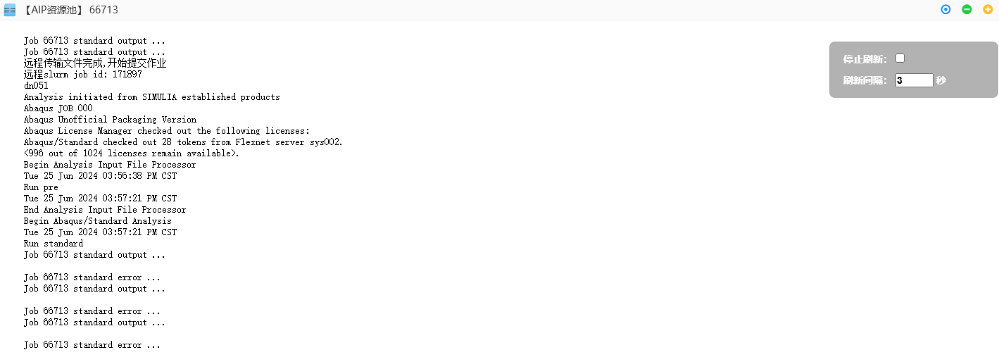
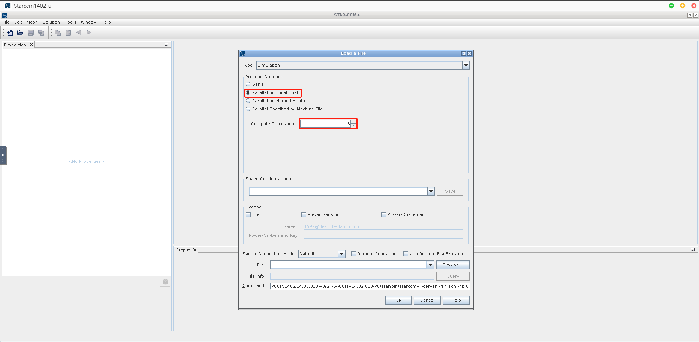
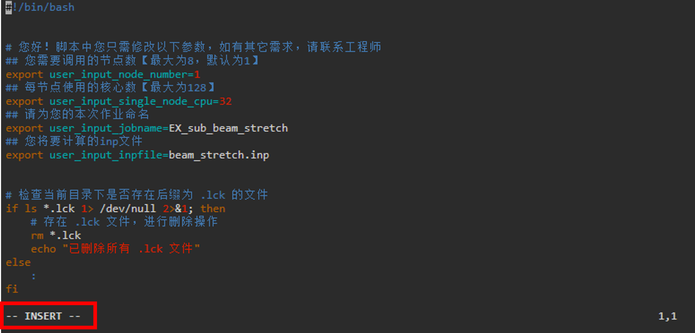

# 第2章 案例演示

## 2.1 访问用户门户

<!-- <div id="GUI_app"></div>

<span id="jump">跳转到的地方</span> -->

您可以使用Web浏览器访问"神工坊"高性能仿真平台V2.0用户门户。

建议您使用Google Chrome或Microsoft Edge浏览器访问。

### 用户注册

a）打开浏览器，输入神工坊门户地址：[simforge.cn](http://simforge.cn/)，单击免费试用，进入平台注册登录页面:


b）点击 前往注册 进入注册界面：


c）输入用户昵称、邮箱、手机号等相应信息，点击获取验证码，填入手机验证码，立即提交:


d）注册成功后，弹出注册成功提醒:


e）账号及密码会发送至手机短信：（此时账户为试用用户，想成为VIP用户，需进行{ref}`VIP用户申请`）


### 用户登录

a）注册成功后，用户返回登录界面，或重新输入平台门户，点击登录，进入登录页面，可选择账号登录或者手机号登录：


b）点击登录，即可进入用户门户


<!--  -->

### 用户退出

a）单击topbar 右上角 用户管理 按钮，下拉框选择 退出，弹窗 单击 确定按钮，完成用户的退出


### VIP用户申请

a）登录试用账户后，单击topbar右上角用户管理按钮，下拉框选择 正式用户申请，进入权益升级信息填写界面，填写相关信息，填写完成后，点击提交，等待管理员审核，审核通过后，即可成为VIP用户。


### VIP用户权益

相比于试用用户，VIP用户拥有以下权益：

1. VIP用户的应用商城中拥有更多的应用，可供正式用户订阅使用。
2. VIP用户的并行核数没有上限。
3. VIP用户享受更多的技术支持服务，包括但不限于专属技术顾问、软件安装协助等服务。

<center>表 2-1 “神工坊“正式用户可订阅的更多应用</center>


### 重置密码

用户忘记密码后，可在登录界面点击右下角的忘记密码。


输入注册账号时使用的邮箱，点击获取验证码，邮箱会收到验证码。输入验证码后，点击重置密码，邮箱会收到重置后的密码。


## 2.2 仿真计算

### 案例一：Abaqus 仿真计算应用

**案例说明**
本案例展示了最基础的提交仿真计算作业的方式。

**操作演示**
以下为具体操作步骤。

#### 1. 工程文件上传

- 登录平台后，单击底部dock栏 **数据管理**图标，打开数据管理窗口，单击**上传文件**按钮，上传工程文件：

    

#### 2. 上传

- 点选或者拖放上传工程文件至平台：
    

#### 3. 启动应用

- 登录平台后，**单击**底部dock栏**仿真计算**图标，进入仿真计算应用桌面，**双击**桌面**Abaqus-a**软件图标，弹出作业提交界面：
    

#### 4. 作业参数设置

- 输入作业相关参数，单击**选择文件**，选中上传的工程文件，双击完成选择：
    

#### 5. 作业提交

- 单击提交，完成作业的提交，进入作业详情界面：
    

#### 6. 查看输出

- 单击查看输出，进入作业输出界面：
    

#### 7. 计算完成，查看结果

- 单击**作业数据**，进入个人文件目录，即可查看输出结果文件。如需关闭后再次查看，请点击下方dock栏**作业管理**，点击作业号进入。
    

### 案例二：StarCCM+ 仿真计算应用

**案例说明**
本案例展示了基于“神工坊”V2.0 进行StarCCM+仿真作业及在线协同的基本操作，演示算例是一个千万网格的搅拌器模型。

**操作演示**
以下展示具体的操作步骤

#### 1. 启动应用

- 登录平台后，**单击**底部dock栏**仿真计算**图标，进入仿真计算应用桌面，**双击**桌面StarCCM-a软件图标，弹出作业提交界面：
    

#### 2. 作业参数设置

- 输入作业相关参数，单击提交，提交计算：

**资源池：** 选择AIP资源池

**GUI：** 图形显示方式，选择VNC

**队列：** 作业提交的队列，仿真计算应用 选择q_x86_sf

**使用节点个数：** 拟使用的节点个数

**每节点核心数：** 每个节点上所使用的核心数  实际使用总CPU核数=使用节点个数 × 每节点核心数，q_x86_sf队列，每节点使用的核心数不能超过128核
    

#### 3. 作业详情

- 提交后进入作业详情界面，显示作业一些详细信息。单击 图形窗口 按钮，进入软件原生界面：
    
    

#### 4. 软件并行设置

- 软件操作同本地一致，其中并行模式选择 parallel on Local Host，并行核数同 2. 步骤中一致
    

#### 5. 在线协同

- 对于企业用户，在平台有多个用户，可以在线共享图形界面（仅支持VNC模式），单击顶栏功能管理下拉框，选择在线协同：
    

#### 6. 共享作业

- 弹出的在线协同窗口中选择作业连接页面，选择要共享的作业，单击操作列里的分享按钮：
    

#### 7. 共享成员选择

- 弹窗中选择共享模式，选择需要共享给的成员，点击提交：
    **观察：** 被共享者只可观看图形界面
    **互动：** 被共享者可操作图形界面
    

#### 8. 共享成功

- 共享成功后，作业 操作列 按钮增加断开分享按钮，点击可以端口分共享：
    

#### 9. 协同作业

- 被共享者，登录桌面后，在 在线协同 界面，协同连接 子页面可以查看被共享的作业，点击连接进入共享界面:
    

### 案例三：脚本提交

**案例说明:**
本案例展示了使用脚本提交仿真计算作业的方式。相较于平台界面提交作业，脚本提交作业更加灵活，依据本教程可快速掌握。示例使用软件为 Abaqus2017

**操作演示:**
以下展示了具体的操作步骤。

#### 1. 示例文件获取

- 点击右上角，选择命令终端，打开命令终端窗口
    
- 示例程序位于```/share/simforge_share/script_examples```目录下，其中包含了提交到各个计算队列的各种软件的脚本模板。
- 首先需要将示例程序拷贝到用户目录下，在终端上执行命令：

    ``` shell
    cp -r /share/simforge_share/script_examples ~/script_examples
    ```

    

#### 2. 复制建立新的提交文件夹

- 首先进入q_intel_share队列的abaqus2017模板文件夹中：

    ```shell
    cd q_intel_share/abaqus/2017/beam_stretch/
    ```

    

- 在提交新作业时，建议建立一个新的作业文件夹：

    ```shell
    cp -r beam_stretch beam_stretch_sub1
    ```

    

#### 3. 上传自己的计算文件

- 把将要运算的inp文件拖动到作业文件夹(beam_stretch_sub1)中：这一步骤可使用**数据管理**的文件管理界面完成操作。

#### 4. 修改demo.sh文件中的参数

**方法1:**

- 进入新建立的作业文件夹:

    ```shell
    cd beam_stretch_sub1
    ```

- 使用vim编辑器打开 demo.sh 文件:

    ```shell
    vim demo.sh
    ```

    
    

- 点击 **i** 按键. 随后 vim 编辑器下方会显示 **INSERT** 表示进入编辑模式

    

- 在编辑器中修改对应的脚本参数

    
    

- 编辑完成后,点击**esc**按键退出编辑模式
- 在vim编辑器的命令行输入```:wq```，敲击**enter**，保存并退出编辑器

    

**************************************
**方法2:**

- 右键demo文件,点击文本编辑

    

- 编辑相关内容后,单击编辑器**保存并关闭**按钮,完成编辑

    

#### 5. 提交作业任务

- 赋予文件执行权限

    ```shell
    chmod +x demo.sh
    chmod +x submit-q_intel_share.sh
    ```

- 执行submit-q_intel_share.sh文件，可将demo.sh提交至指定队列运行计算

    ```shell
    ./submit-q_intel_share.sh 
    ```

    

#### 6. 可至神工坊 [作业管理] 查看本次作业提交

#### 7. 结果文件会自动保存在当前文件目录下


## 2.3 图形应用

### 案例四：ICEMCFD 图形应用案例

**案例说明**
本案例演示了通过远程桌面（VDI）模式使用ICEMCFD，VDI模式具有更高的流畅度和清晰度，为复杂模型的前后处理工作提供了较好的用户体验。

**操作演示**
以下为具体操作步骤。

#### 1. 远程桌面开通

- 点击桌面底部dock栏**远程桌面**图标，弹出远程桌面开通界面：


#### 2. 进入远程桌面

- 单击开通后，弹出远程桌面进入界面，单击图标，进入远程桌面


#### 3. 远程桌面窗口

- 远程桌面窗口如下所示：


#### 4. 软件启动

- 单击底部dock栏**图形应用**，双击桌面ICEMCFD图标，软件启动：


#### 5. 软件启动成功

- 软件启动成功后，会自动切换至VDI桌面窗口，软件已启动，软件的操作同用户本地使用一样，具体使用参考ICEMCFD帮助文档


#### 6. 隐藏dock栏

- dock栏会遮挡VDI桌面，影响底部区域的鼠标操作，因此需要隐藏。单击dock中间锁按钮，将其解锁。

- 解锁状态，鼠标移开dock区域，或者单击桌面其他区，dock栏会自动隐藏至桌面底部，鼠标向下划过桌面边界，dock栏再次浮现：


### 案例五：CFD-Post图形应用案例

**案例说明**
本案例演示了通过VNC模式使用CFD-Post图形应用，VNC模式支持图形窗口的在线共享。

**操作演示**
以下为具体操作步骤

#### 1. 实例创建

- 右击CFD-Post桌面图标，选择编辑实例：


#### 2. 新增实例

- 弹窗弹出实例创建界面，单击右上角新增实例，填写实例参数：


#### 3. 设置默认实例

- 单击保存后新增实例成功，勾选新增实例，单击右上角设置为默认实例按钮，弹窗点击确定，设置CFD-Post图形应用默认启动方式为VNC：


#### 4. 启动软件

- 双击桌面图标，此时CFD-Post将以VNC模式启动


## 2.4 软件安装

如果在应用商城没有找到需要的仿真软件，平台也支持软件安装，主要是通过以下两种方式：

### 方式一：使用命令终端安装

点击平台界面右上角的功能区，进入命令终端，可以使用命令行（Linux操作系统）进行软件安装。如安装时需加载编译器和库，加载方式见 {ref}`加载编译器和库`。


### 方式二：使用图形界面安装

开通并连接远程桌面后，进入centos 7.9的图形桌面，可以使用图形界面进行安装。


### 安装案例

本次安装以使用图形界面安装Abaqus 614版本软件为例(如其他软件需加载编译器或库，加载方式与使用命令终端安装的加载方式相同)：

**1）** 在右上角的功能区中，点击数据管理，进入个人目录，上传软件安装包。


**2）** 进入远程桌面，点击桌面的Home图标，进入个人目录，找到软件安装包所在位置，点击鼠标右键，选择Open in Terminal,打开命令终端。


**3）** 解压软件安装包。
解压zip压缩包命令：unzip xxx.zip
解压tar压缩包命令：tar -xf xxx.tar


**4）** 使用命令“/share/ xxx /Abaqus/lnx86_64/setup”（需使用绝对路径）。提示需TMPDIR路径时，使用软件安装位置的路径即可，完成后即可进入Abaqus614的安装界面。


**5）** 点击Next按钮，Installation type阶段，选择Abaqus Product，然后点击Next。


**4）** 在License server中，根据软件官方需求，在License server 1(REQUIRED)中输入相应内容，（如需使用本机名，可使用hostname命令进行查询）,之后点击Next。


**5）** 在Abaqus license servers中，输入官方需求内容，然后点击Next。


**6）** Installation directory阶段，选择安装路径。点击Next后，点击Install。


**7）** 终端出现finished字样，即可使用Abaqus614了。


### 安装软件使用

以安装的Abaqus 614为例。
如需要使用软件进行前处理工作，图形界面启动的命令：/share/ xxx /Abaqus/Commands/abaqus cae

如需使用GPU启动图形界面，命令为：vglrun /share/ xxx /Abaqus/Commands/abaqus cae

如果只需要提交作业的话，除了使用图形界面提交，还可使用命令行进行本地提交作业。命令为（适用于小规模作业）：/share/ xxx /Abaqus/Commands/abaqus job=xxxx input=xxxx.inp cpus=xx int


如需使用大规模计算，命令为csub -I -q q_x86_sf -n 8 /share/ xxx /Abaqus/Commands/abaqus job=xxxx input=xxxx.inp cpus=xx int

- -I：交互式。程序输出会打印到终端，终端关闭则程序终止运行。
- -q：后接队列名，如q_x86_sf
- -n：后接程序运行使用核心数

详细提交方式见 {ref}`递交作业`

## 2.5 常见问题

### 1. 文件夹过大

  &ensp;我在提交作业后提示我文件夹大小超过2G，作业无法提交，我该怎么办？  
  &ensp;答：作业开始计算前，需要将输入文件所在的文件夹传输到集群主机，如果当前文件夹下存在较大数据，这会增加传输时间。建议您每一个作业都在一个新建立的文件夹中开始计算，一个作业对应一个新的文件夹。  

### 2. 内存不足

  &ensp;客服提示我作业无故退出的原因是内存不足，这是为什么？  
  &ensp;答：计算集群的每个节点都有自己的内存，用于存储该节点正在处理的数据和程序的执行状态。每个计算作业可以使用的内存大小是根据您调取的核心数来确定的，当出现该问题时，您应该适当提高调取的节点数与核心数。如果您的作业确实需要很大的内存，您可以勾选【是否独占队列】，同时【每节点核心数】不要选取最大值，这样整个节点的内存都会为您所用。虽然较少的核心数会导致计算时间变长，但是这样可以使得每核心内存增加，使得计算可以进行下去。  
  
### 3. 文件名称中存在空格

  &ensp;我在应用中提交作业的时候，弹窗提示我文件名中不可以有空格，应该怎么办？  
  &ensp;答：文件名与文件路径中包含空格会导致在命令行操作和脚本编写中出现问题。为避免此类问题，建议您重命名文件：将文件名中的空格替换为下划线（_）或破折号（-），例如将 example file.txt 重命名为 example_file.txt 或 example-file.txt。并再次检查您的文件上层路径中是否存在空格！  

### 4. 子目录传输

  &ensp;我发现在应用界面中有一个【是否传输子目录】的选项，这个功能有什么作用呢？  

    

  &ensp;答：在远程计算资源传输数据的过程中，若不勾选此项，则不会传输作业目录下的文件夹以及其下的文件，若存在文件夹，而又没有勾选此项，文件夹就会被识别为一个空文本文件进行传输，因此当您需要目录下的文件夹以及其下的文件也参与计算时，请勾选此项。 

### 5. 一个文件夹内提交多个作业

  &ensp;我在应用中提交作业的时候，弹窗提示我当前文件下有作业正在运行，不能提交作业，应该怎么办？  
  &ensp;答：这是因为您当前文件夹下有遗留的作业仍未计算完毕，在同一个文件夹下提交两个作业会导致数据传输出现混乱，因此平台做了限制。建议您每一个作业都在一个全新建立的文件夹中开始计算，一个作业对应一个新的文件夹。  

### 6. 作业等待

  &ensp;我在应用中提交作业的时候，界面显示作业状态处于等待，应该怎么办？  
  &ensp;答：这是因为当前使用计算资源的用户较多，如果您提交的作业是1节点×128核心，可以尝试改为2×64核心或者4×32核心提交。如果还是处于等待状态，您可以稍后错峰使用。
